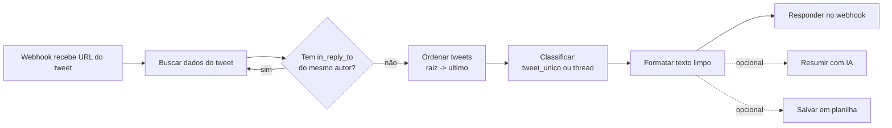

# Capturador de Tópicos do Twitter (Twitter Thread Fetcher)

Automação em **n8n** (com implementação de referência em **Python**) que recebe o link de um tweet, identifica automaticamente se ele é um **tweet único** ou faz parte de uma **thread completa**, reconstrói a sequência inteira na ordem correta e devolve um texto limpo — pronto para arquivar, indexar ou resumir com IA.

Extrair uma thread do Twitter/X manualmente é copiar tweet por tweet, na ordem certa, sem perder nenhum. Esta automação resolve isso com uma chamada — via webhook no n8n ou via script Python — e sem depender de acesso pago à API do Twitter/X.

---

## O problema que resolve

Quem pesquisa, cura conteúdo ou monitora redes sociais perde tempo real reconstruindo threads manualmente: abrir o tweet, descer clicando em "mostrar resposta", copiar, colar, repetir. Esta automação:

- Recebe **qualquer link de tweet da thread** (o primeiro, o último ou um do meio).
- Descobre sozinha se é um tweet isolado ou parte de uma sequência de auto-respostas do mesmo autor.
- Reconstrói a ordem cronológica correta, do primeiro ao último tweet.
- Entrega o resultado em **JSON estruturado** (dado por tweet: texto, autor, data, curtidas, respostas, retweets) e em **Markdown limpo**, pronto para leitura, arquivamento ou como entrada de um resumidor de IA.

## Como funciona



A captura usa o **endpoint público de sindicação do Twitter/X** — o mesmo que o próprio Twitter/X usa para gerar os cartões de "embed" de tweets em sites de terceiros. Ele não exige API key nem login, o que torna a automação utilizável imediatamente, sem custo de acesso à API oficial (a busca paga da API v2 do X para reconstruir conversas antigas custa a partir do plano Basic, US$ 200/mês).

A partir do tweet informado, o fluxo segue a cadeia `in_reply_to_status_id` **para trás**, tweet a tweet, enquanto cada resposta for do mesmo autor — exatamente a mesma lógica usada por serviços conhecidos de "unroll" de threads. Quando encontra a raiz (sem resposta anterior) ou uma resposta de outra pessoa, para e classifica o resultado.

## Funcionalidades

- ✅ Detecção automática: **tweet único** vs. **thread completa**.
- ✅ Reconstrução da ordem cronológica correta, a partir de qualquer tweet da sequência.
- ✅ Sem necessidade de API key do Twitter/X para o modo de captura padrão.
- ✅ Saída em JSON (dados estruturados) e Markdown (texto limpo).
- ✅ Metadados por tweet: autor, data, curtidas, respostas, retweets.
- ✅ Extensível: branch pronto no workflow para resumir a thread com IA (OpenAI/Anthropic) e para salvar o resultado em Google Sheets — ambos desligados por padrão, prontos para ativar configurando a credencial.

## Arquitetura do workflow n8n

Arquivo: [`workflow/Capturador_Topicos_Twitter.json`](workflow/Capturador_Topicos_Twitter.json)

| Nó | Função |
|---|---|
| **Receber Link do Tweet** | Webhook (`POST /capturar-thread`) que recebe `{ "url": "https://x.com/usuario/status/123" }` |
| **Montar Thread** | Extrai o ID do tweet, busca os dados e percorre a cadeia de respostas até a raiz |
| **Formatar Texto Limpo** | Monta o Markdown legível a partir dos tweets já ordenados |
| **Responder com Resultado** | Devolve o JSON completo como resposta do webhook |
| **É uma thread?** *(opcional)* | Roteia threads para o resumo por IA; tweets únicos vão direto para o armazenamento |
| **Resumir com IA (opcional)** | Chamada HTTP para um LLM (OpenAI/Anthropic) resumindo a thread em bullet points — desligado por padrão |
| **Salvar no Google Sheets (opcional)** | Acrescenta uma linha com o resultado numa planilha — desligado por padrão |

### Importar no n8n

1. Abra o n8n → **Workflows → Import from File**.
2. Selecione `workflow/Capturador_Topicos_Twitter.json`.
3. Ative o workflow. O webhook fica disponível em `POST /webhook/capturar-thread`.
4. Teste:

```bash
curl -X POST https://SEU_N8N/webhook/capturar-thread \
  -H "Content-Type: application/json" \
  -d '{"url": "https://x.com/naval/status/1002109558058237953"}'
```

Para habilitar o resumo por IA ou o armazenamento em planilha: configure a credencial correspondente no nó desligado e ative-o (clique direito → *Activate*).

## Implementação de referência em Python

Arquivo: [`scripts/twitter_thread_fetcher.py`](scripts/twitter_thread_fetcher.py) — mesma lógica do workflow, em Python puro (sem dependências externas, só biblioteca padrão), útil para rodar localmente, agendar via cron ou usar como base de testes.

```bash
python scripts/twitter_thread_fetcher.py --url "https://x.com/naval/status/1002109558058237953" --out dados/exemplos --nome minha_thread
```

## Exemplos reais capturados

A pasta [`dados/exemplos`](dados/exemplos) contém capturas reais, geradas rodando o script contra tweets públicos:

| Exemplo | Classificação | Tweets capturados |
|---|---|---|
| [`thread_naval_como_enriquecer`](dados/exemplos/thread_naval_como_enriquecer.md) | `thread` | 40 (thread completa "How to Get Rich" de @naval, reconstruída a partir do último tweet) |
| [`tweet_unico_jack`](dados/exemplos/tweet_unico_jack.md) | `tweet_unico` | 1 (primeiro tweet da história do Twitter, @jack) |

## Indo além (ideias de extensão)

- **Resumo automático por IA**: o branch "Resumir com IA" já está pronto no workflow — basta configurar a credencial da LLM.
- **Arquivamento**: trocar o Google Sheets por Notion, Airtable ou um banco de dados.
- **Disparo automático**: acionar a captura a partir de uma menção, um formulário ou uma linha nova numa planilha de "para capturar depois".
- **API oficial do X**: para volumes altos ou uso comercial recorrente, o mesmo workflow pode ser adaptado para consumir a API v2 oficial do X (com Bearer Token) em vez do endpoint de sindicação — ver [`docs/DOCUMENTACAO_TECNICA.md`](docs/DOCUMENTACAO_TECNICA.md) para o comparativo.

## Limitações conhecidas

- Funciona para **threads de auto-resposta** (o mesmo autor respondendo a si mesmo em sequência) — o formato usado por praticamente todas as threads reais do Twitter/X.
- A reconstrução caminha **para trás** a partir do tweet informado até a raiz. Se for informado um tweet do meio da thread, os tweets **posteriores** a ele não são capturados (o Twitter/X não expõe publicamente "o próximo tweet da thread" sem a API paga de busca) — informe o **último** tweet da thread para capturar tudo.
- Depende de um endpoint público não documentado oficialmente pelo Twitter/X; se ele mudar de comportamento, o workflow pode precisar de ajuste (ver alternativa com API oficial na documentação técnica).

## Stack

`n8n` · `Python 3` · `Webhook` · `Twitter/X (endpoint de sindicação pública)` · opcionalmente `OpenAI/Anthropic API` · `Google Sheets API`

---

Projeto de portfólio — automações e integrações com n8n.
